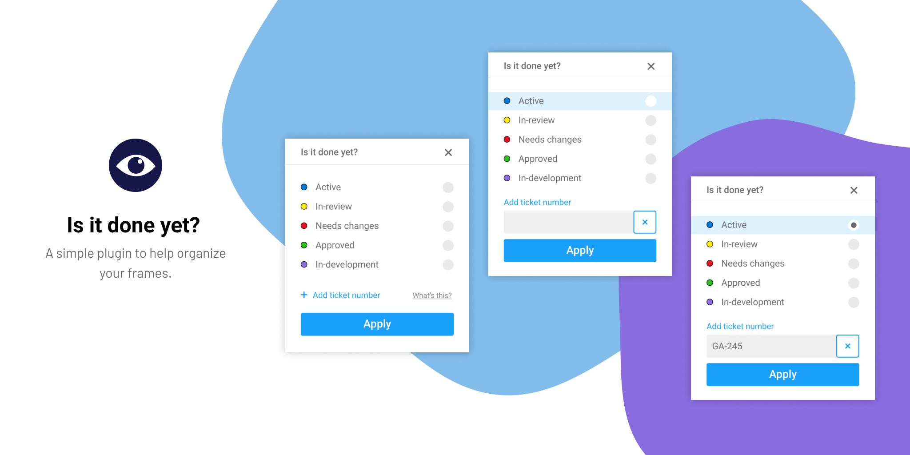

# Is it Done Yet ?

> A simple Figma plugin to help organize your frames

## Description
__*Is It Done Yet?*__  is a simple plugin that enables you to organize frames according to their progress status by adding a tag alongside each  name. It also allows you to add a ticket number for further organization.
* __For designers__ -  Quickly communicate the status of their designs and make it easier to mark designs for review and hand over files for development.
* __For developers__ - Clearly marked files that they can work on, leaving no room for confusion or error.
* __For PM's__ - know what’s ready to groom
* __For Clients__ - Reduce confusion and save time on turn-around by letting them know precisely what’s ready for approval

## Usage example
1. Install *Is It Done Yet?* from the Figma Plugin library 
2. Select any frame or multiple frames in your Figma document
3. Right click > Plugin > *Is It Done Yet?*
4. Select a status that you want added to the selected frames. 
5. Optionally, you could choose to add a ticket number to any frame for further organization. 

## Release History

* V1.0.0
  * Initial version of *Is it Done Yet?* consists of setting status to frame(s) and support to add assign ticket numbers to frames

